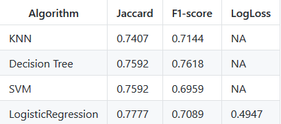

# IBM-final-project-Machine-Learning
Final project of IBM's course https://www.coursera.org/learn/machine-learning-with-python on coursera

A simple comparison between KNN,SVM,Decision Tree and Logistic Regression models on a given data set of loans records.

Please read the note book for information about the data and implementation of classifiers used.

Please note that results may be improved by engineering new features or using different hyper parameters ,I have tried just to create a simple prediction only for demonstrating use of different classifiers from scikit learn library .
